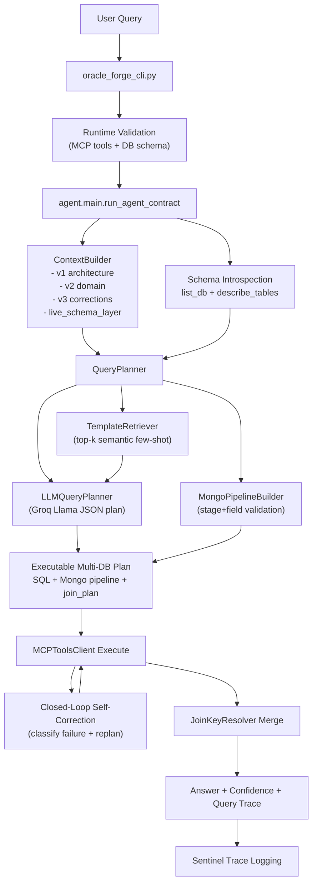

# Oracle Forge Usage

## What Was Implemented

- Preserved and extended existing core systems:
`ContextBuilder` (3-layer injection), `JoinKeyResolver`, self-correction loop, Sentinel trace flow, and probe framework.
- Added LLM-first planning path:
`agent/planner/llm_query_planner.py`
- Added semantic few-shot retrieval:
`agent/templates/template_retriever.py`
- Added Mongo pipeline generation and validation:
`agent/planner/mongo_pipeline_builder.py`
- Upgraded `agent/planner.py` to:
  - use LLM-generated SQL/pipelines first
  - fallback safely to heuristics only on LLM failure
  - route databases by schema/table/column overlap instead of static keyword rules
- Upgraded context construction in `agent/context_builder.py`:
  - smart context selection
  - added `live_schema_layer`
  - enforced priority: live schema > domain > corrections
- Added evaluation infrastructure modules:
  - `eval/metrics.py` (Wilson CI)
  - `eval/regression_gate.py` (pass@1 drop gate)
- Upgraded `eval/run_dab_eval.py` to support:
  - Wilson CI
  - regression gate
  - `--paraphrase N` hook + `eval/paraphrase_results.json`
- Added single runtime CLI entrypoint:
`oracle_forge_cli.py`

## End-to-End Run

1. Configure `.env` with Groq and MCP/DB settings.
2. Start MCP tools/database services.
3. Run the agent directly:

```powershell
python oracle_forge_cli.py --query "Which U.S. state has the highest number of reviews?" --databases duckdb,mongodb --trace
```

4. The CLI validates:
- MCP tool discovery
- requested DB availability
- schema visibility per DB

5. Output includes:
- `answer`
- `confidence`
- optional `query_trace`

## Environment Variables

Required:
- `GROQ_API_KEY`
- `MODEL_NAME` (Llama model on Groq, e.g. `llama-3.3-70b-versatile`)
- `MCP_BASE_URL`

Recommended safety:
- `MAX_PROMPT_TOKENS`
- `MAX_TOOL_LOOPS`
- `ORACLE_FORGE_MOCK_MODE=false`
- `ORACLE_FORGE_ALLOW_MOCK_FALLBACK=false`

## Architecture



## Plain-English Architecture

- The CLI validates MCP tools and DB schema before query execution.
- `ContextBuilder` injects only relevant KB slices plus live schema for the active query.
- `QueryPlanner` attempts LLM-first planning with Groq Llama:
  - database selection
  - SQL for PostgreSQL/SQLite/DuckDB
  - Mongo aggregation pipeline
  - join strategy
- Few-shot examples are selected semantically from existing Yelp templates (not exact string matching).
- If LLM planning fails, planner falls back to safe deterministic query generation.
- Execution runs through MCP tools with Sentinel trace events.
- Failures are classified (`dialect_error`, `join_key_mismatch`, `schema_error`, `tool_routing_error`) and fed into automatic replanning.
- Multi-DB outputs are merged via `JoinKeyResolver`, then returned with confidence and trace.

## Paraphrase Capability

`eval/run_dab_eval.py` supports:

```powershell
python eval/run_dab_eval.py --dataset yelp --trials 1 --paraphrase 3
```

This stores paraphrase execution output in:
- `eval/paraphrase_results.json`

## Notes

- No RAG was introduced.
- Existing KB structure and correction-loop foundations were preserved.
- Evaluation commands were not executed as part of this implementation pass.

## Stability Addendum (Current)

### Correctness Safeguards Added

- `agent/planner/plan_validator.py`
  - validates LLM SQL tables/columns against live schema
  - validates Mongo fields and `$group._id`
  - validates join keys across planned DBs
  - applies lightweight auto-fixes when safe, otherwise marks plan invalid
  - planner performs one extra LLM replan when invalid

- `agent/execution/result_validator.py`
  - detects suspicious outcomes:
    - empty result for aggregation-like questions
    - missing count-style aggregation signal
    - join mismatch signal in trace
  - triggers one bounded replan path

- `utils/join_key_resolver.py`
  - now performs sampled key compatibility checks (<=10 rows)
  - tries normalization strategies (`default`, `string_cast`, `prefix_strip`)
  - emits join mismatch failure signal when incompatible

### Query Quality Improvements

- `agent/preprocessing/query_normalizer.py`
  - normalization used only for routing/template retrieval:
    - lowercase
    - `how many -> count`
    - `highest -> max`

- `agent/planner/mongo_pipeline_builder.py`
  - enforces stage order:
    `$match -> $group -> $project -> $sort -> $limit`
  - strips invalid schema fields
  - auto-fixes missing `$group._id`

- `agent/planner/llm_query_planner.py`
  - switched to OpenRouter API (no new dependency)
  - model from `MODEL_NAME`
  - prompt now anchors to few-shot structure unless clearly incorrect

### OpenRouter and Model Selection

Required in `.env`:

- `OPENROUTER_API_KEY`
- `MODEL_NAME` (default model)

Optional:

- `OPENROUTER_BASE_URL`
- `OPENROUTER_SITE_URL`
- `OPENROUTER_APP_NAME`

CLI model override for one run:

```powershell
python oracle_forge_cli.py --query "..." --databases duckdb,mongodb --model openai/gpt-5 --trace
```

If `--model` is provided, it overrides `MODEL_NAME` for that process only.

### Operational Notes

- Architecture remains unchanged (no new orchestration layer).
- ContextBuilder design and KB layering remain intact.
- Token limiter policy remains unchanged.
- Eval harness entrypoints remain intact; no evaluation execution is required for this upgrade.
